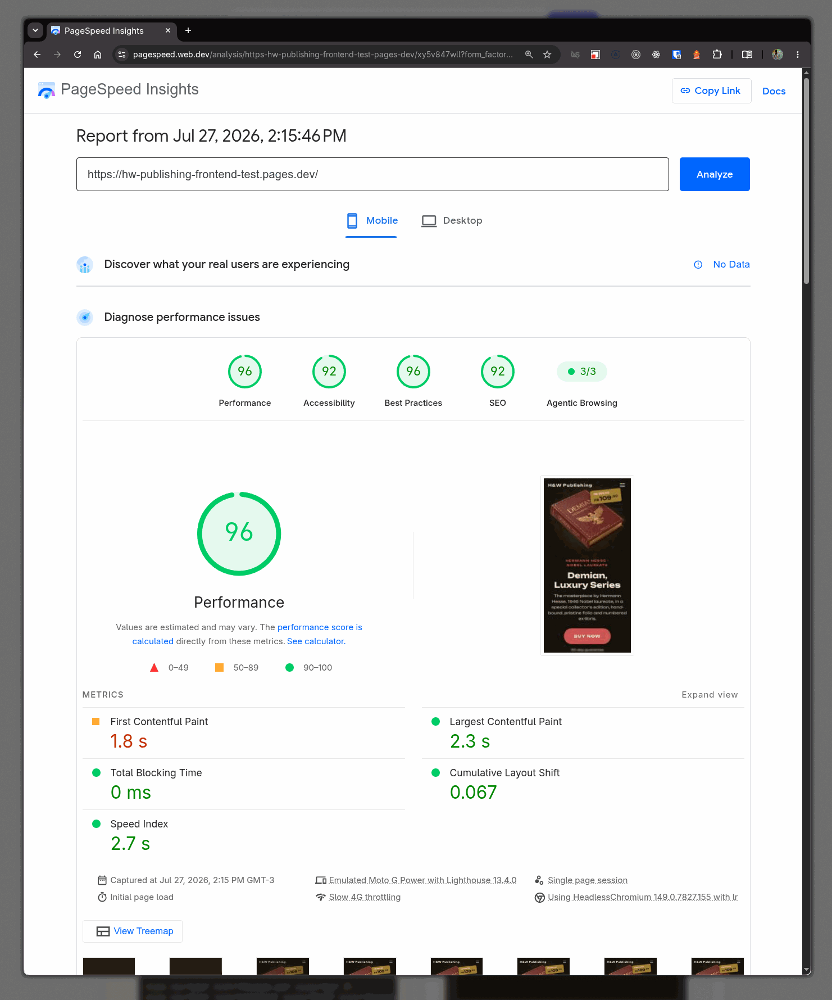
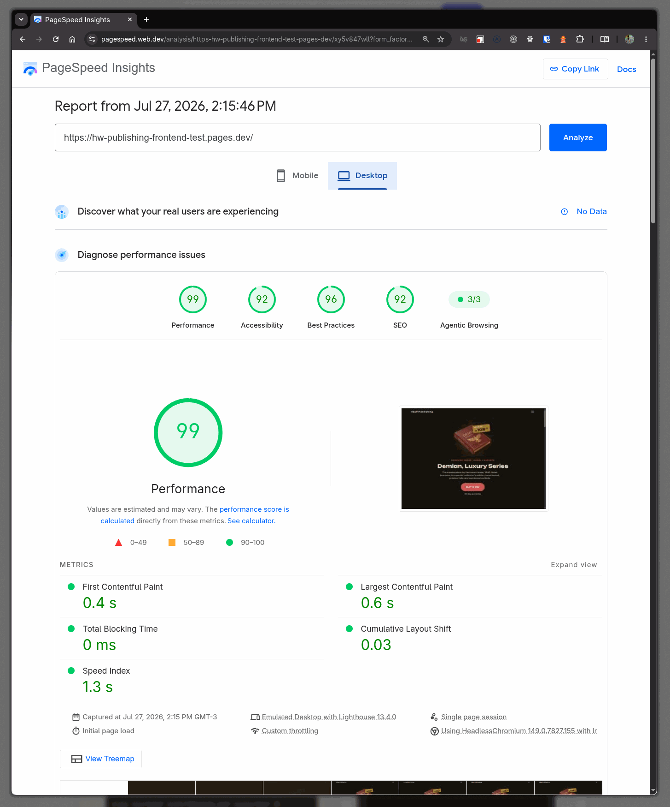

# Demian - Série Luxo | H&W Publishing

Fluxo de vendas digital para exemplar raro de colecionador.

## Como Executar

```bash
npm install
npm run dev        # Desenvolvimento (porta 3000)
npm run build      # Produção
npm run preview    # Preview do build
```

## Performance

Relatório do [PageSpeed Insights](https://pagespeed.web.dev/analysis/https-hw-publishing-frontend-test-pages-dev/fb9lrsa6i8?form_factor=desktop) (Lighthouse) para
`https://hw-publishing-frontend-test.pages.dev/` — capturado em 27/07/2026.

| Dispositivo | Performance | Acessibilidade | Best Practices | SEO |
| ----------- | :---------: | :------------: | :------------: | :-: |
| Mobile      |     96      |       92       |       96       | 92  |
| Desktop     |     99      |       92       |       96       | 92  |

**Mobile** — FCP 1.8s · LCP 2.3s · TBT 0ms · CLS 0.067 · SI 2.7s



**Desktop** — FCP 0.4s · LCP 0.6s · TBT 0ms · CLS 0.03 · SI 1.3s



## Lint e Teste

```bash
npm run lint            # ESLint em src/js/
npm run lint:css        # Stylelint em src/css/
npm run lint:fix        # Corrigir ESLint automaticamente
npm run lint:css:fix    # Corrigir Stylelint automaticamente
npm test                # Vitest (watch)
npm run test:run       # Vitest (run único)
npm run test:coverage   # Vitest com cobertura
npm run format          # Prettier
npm run format:check    # Verificar Prettier
npm run check           # Lint + format check
```

## Pastas do Projeto

### CSS (`src/css/`)
- `base/` - Reset, variáveis, tipografia, transições, utilitários, fontes
- `components/` - Botões, carrossel, footer, header, hero, preço, garantia, depoimentos, agradecimento, upsell legal, loader
- `styles.css` - Entry global que importa todos os módulos

### JavaScript (`src/js/`)
- `core/` - i18n, pub/sub, utilitários, view-transitions
- `features/landing/` - Carrossel (Embla)
- `features/layout/` - Glass edges, toggle de idioma
- `pages/` - Landing, upsell, thank-you, terms, privacy

### HTML (`pages/`)
- `index.html` - Landing page
- `upsell.html` - Pós-venda (oferta complementar)
- `thank-you.html` - Confirmação do pedido
- `terms.html` - Termos de uso
- `privacy.html` - Política de privacidade

### Locales (`src/locales/`)
- `pt-BR.json` - Português (padrão)
- `en-US.json` - Inglês

### Testes (`tests/`)
- `unit/` - Testes unitários
- `integration/` - Testes de integração de páginas
- `setup.js` - Configuração global (jsdom, localStorage mock)
- `helpers.js` - Mocks para gsap e IntersectionObserver